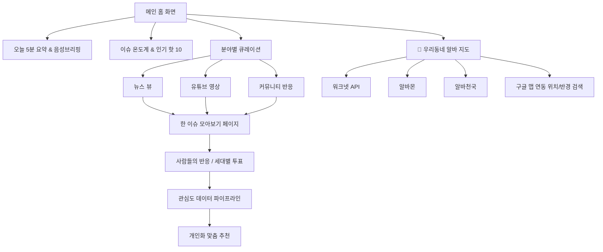

# 🚀 [시니어 친화형 이슈 큐레이션 & 우리동네 알바 정보 플랫폼] 개발 기획서

> **원칙 준수**: 본 기획서는 `/Users/junseok/Desktop/사이트 개발` 폴더 내에 저장 및 관리됩니다.

---

## 1. 프로젝트 개요 (Overview)

### 1.1 프로젝트 명칭 (추천 브랜드안)
- **메인 추천**: **`오늘의 기준`** *(서브 타이틀: 세상의 이슈와 우리 동네 소식을 한눈에)*
- **대안 브랜드**: `한눈에(Han-Noon)`, `세상&동네`, `모아봄`

### 1.2 핵심 타깃 및 서비스 서비스 콘셉트
- **핵심 타깃**: 50대 이상 액티브 시니어 (5060+ 세대)
- **서비스 가치**: 
  - 정보 과화 시대에 **"오늘 꼭 봐야 할 세상 이야기"**와 **"내 위치 주변의 일자리/알바 정보"**를 가장 쉽고 명확하게 큐레이션해주는 통합 플랫폼.
  - 뉴스 링크 단순 나열이 아닌, **언론사 + 유튜브 + 커뮤니티 + 우리동네 일자리**를 하나의 주제/지도 형태로 재가공하여 제공.

---

## 2. 전체 서비스 구조 (Information Architecture)



---

## 3. 5대 핵심 차별화 기능 상세 기획

### 🎯 [핵심 추가] 1. 구글 맵 연동 "우리동네 맞춤 알바 지도"
5060 세대의 활동성과 경제 활동 니즈를 반영하여, 뉴스/이슈 큐레이션과 더불어 **'위치 기반 맞춤 알바/일자리'**를 대메뉴 핵심 축으로 배치합니다.

- **데이터 수집 체계**:
  - **워크넷(Worknet)**: 중장년/시니어 우대 공공 채용 API 연동
  - **알바몬 & 알바천국**: 지역별/업종별 채용 데이터 수집 및 정제
- **구글 맵(Google Maps API) 연동 UX**:
  - **현재 위치 자동 인식 & 주소 검색기**: "용인시 수지구", "서울 마포구" 등 검색 지원.
  - **반경 필터**: 1km (도보권), 3km (대중교통 15분), 5km 이내 설정.
  - **채용 핀(Pin) 구분**:
    - 🔵 **워크넷 (시니어우대/공공)**
    - 🟠 **알바몬**
    - 🟡 **알바천국**
- **시니어 특화 채용 필터**:
  - `시니어/중장년 우대`, `체력 부담 적은 일`, `주간 근무`, `단기/일당`, `시급 1만원 이상`
- **상세 카드 UX**:
  - 지도상 핀 클릭 시 **[근무지 위치 + 시급/월급 + 담당 업무 + 원문 지원 링크]**를 수월하게 볼 수 있는 대형 팝업 제공.

### 🎯 6. [신규 추가] 빠른 로딩의 "인앱(In-App) 뷰어" 시스템
외부 사이트나 앱으로 탈출하지 않고, 플랫폼 내부에서 뉴스, 유튜브 영상, 커뮤니티 글, 채용 상세 정보를 최속 로딩으로 확인할 수 있는 인앱 레이어 뷰어입니다.
- **사전 정제 데이터 로딩**: 백엔드에서 미리 텍스트, 이미지, 핵심 데이터를 추출하여 캐싱.
- **인앱 모달/뷰어 스라이드**: 클릭 시 0.1초 만에 화면 내 인앱 스마트 뷰어가 상단에 부드럽게 레이어로 떠올라 즉시 열람 가능.
- **유튜브 인앱 플레이어**: YouTube iframe 모듈을 사이트 내 레이어에 포함하여 이동 없이 재생.
- **채용 상세 인앱 카드**: 워크넷/알바몬/알바천국 상세 요강, 지도, 접수 방법을 외부 이동 없이 바로 확인.

---

### 📌 7. [신규 추가] 하단 고정 네비게이션 & 공유 바 (Sticky Bottom Bar)
시니어 사용자의 간편한 이동과 카카오톡/문자 공유를 위해 페이지 및 뷰어 하단에 항상 고정되는 제어 바를 제공합니다.

```text
┌─────────────────────────────────────────────────────────┐
│ ◀ 이전          [ 📋 URL & 내용 복사 (공유) ]        다음 ▶ │
└─────────────────────────────────────────────────────────┘
```
- **좌측 끝 (◀ 이전)**: 이전 페이지 또는 이전 이슈 콘텐츠로 빠른 이동.
- **우측 끝 (다음 ▶)**: 다음 페이지 또는 다음 추천 콘텐츠로 빠른 이동.
- **가운데 (📋 복사 버튼)**: 클릭 시 현재 보고 있는 정보의 제목과 링크(주소)가 클립보드에 복사되며, "클립보드에 복사되었습니다! 카카오톡이나 문자에 붙여넣어 공유하세요." 안내 팝업 노출.

### ⏰ 8. [신규 추가] 6분 외바늘 시계 & 6분 자동 새로고침 ("실시간 6분 픽")
페이지 상단에 시계바늘 하나만 있는 6분 주기 외바늘 시계 UI를 배치하여 6분마다 세상의 이슈와 채용 정보가 새로워지는 강력한 실시간성을 선사합니다.

```text
       ┌───────────┐
       │   ( 🕐 )  │ 6분 외바늘 타이머 (360초 1회전)
       └─────┬─────┘
             ▼
  [ 6분마다 실시간 자동 새로고침 & 최신 화제 갱신 ]
```
- **6분 1회전 외바늘 시계**: 360초(6분) 동안 시계바늘이 360도 한 바퀴를 도는 직관적 그래픽 시계.
- **6분 자동 데이터 갱신**: 시계바늘이 12시 방향(1바퀴 완료)에 도착할 때마다 "⚡ [6분 갱신] 새로운 화제와 일자리 소식이 업데이트되었습니다!" 토스트 팝업과 함께 최신 데이터를 자동으로 새로고침.

---

### 🔥 2. "이슈 온도계 2.0" & 종합 핫 트렌드
하나의 이슈가 인터넷상에서 얼마나 hot한지를 실시간 온도(°C)와 시각적 열량 그래프로 표현합니다.

- **온도 산출 알고리즘**:
  $$\text{이슈 온도(°C)} = (\text{언론 보도량} \times 0.3) + (\text{유튜브 조회/댓글량} \times 0.3) + (\text{커뮤니티 반응} \times 0.2) + (\text{사이트 내부 클릭/좋아요} \times 0.2)$$
- **시각화 UI**:
  - 36.5°C ~ 99.9°C 의 온도계 및 불꽃 아이콘 표기.
  - 언론 / 유튜브 / 커뮤니티 비중을 한눈에 파악하는 3색 바 그래프.

---

### 📰 3. "한 이슈 모아보기" (뉴스 + 유튜브 + 커뮤니티 3-in-1)
같은 사건이나 이슈에 대해 매체별 시각을 한 화면에서 비교 탐색할 수 있는 큐레이션 페이지입니다.

- **구성 예시**:
  - **[기초 정보 & AI 3줄 요약]**: 바쁜 시니어를 위한 15초 핵심 요약.
  - **[📰 주요 언론 보도]**: 보수/진보/경제지 등 시각별 기사 헤드라인 및 원문 이동.
  - **[▶️ 관련 인기 유튜브]**: 대표 영상 썸네일, 조회수, 핵심 내용 요약.
  - **[💬 주요 커뮤니티 반응]**: 네이버 카페, 클리앙, 뽐뿌, 보배드림 등 대표 글과 여론 흐름.

---

### ⏱️ 4. "오늘 5분" & 시니어 친화적 UX (TTS 지원)
- **오늘 5분 스트림**: 하루 5~10개의 가장 중요한 이슈 및 일자리 헤드라인만 엄선하여 순차 카드로 제공.
- **시니어 전용 UX 기능**:
  - **글자 크기 3단계 조절 버튼** (보통 / 크게 / 아주 크게)
  - **음성으로 듣기(TTS)**: 눈이 피로한 사용자를 위해 기사/이슈 요약을 말로 읽어주는 기능.
  - **고대비 버그 없는 직관적 버튼**: 터치 영역을 48dp 이상으로 확대.

---

### 📊 5. "세대별 공감 반응" & 비로그인 개인화
- **세대별 여론 비교**:
  - 이슈에 대해 `공감해요` / `생각이 달라요` 투표 진행.
  - 50대, 60대, 70대 이상 연령별 투표 비율 차트 공개.
- **쿠키/로컬스토리지 기반 쿠션 개인화**:
  - 회원가입 없이도 이용자가 자주 클릭한 카테고리(예: 건강 40%, 알바 30%, 부동산 30%)를 학습하여 메인 상단 큐레이션 자동 재배치.

---

## 4. 카테고리 구조 설계

| 대분류 | 주요 세부 주제 | 특이 사항 |
| :--- | :--- | :--- |
| **📍 우리동네 알바** | 시니어우대, 단기알바, 소일거리, 매장관리 | 구글 맵 지도 연동 (워크넷/알바몬/알바천국) |
| **📰 시사·사회** | 국가, 이슈, 정보, 사회 소식 | 언론/유튜브 큐레이션 |
| **💰 경제·부동산** | 아파트, 청약, 주식, 연금, 절세 | 실생활 맞춤 정보 |
| **🏥 건강·운동** | 질환 예방, 식단, 운동, 건강기능식품 | 5060 최고 관심 카테고리 |
| **☕ 생활·노후** | 가족, 수당, 자격증, 귀농/귀촌 | 실속 생활 팁 |
| **🎬 문화·취미** | 영화, TV, 트로트/음악, 여행 | 유익한 볼거리 |
| **💬 커뮤니티** | 세대 공감 이야기, 자유게시판, 투표 | 자체 커뮤니티 생성 |

---

## 5. 구글 애드센스(Google AdSense) 승인 및 수익화 전략

단순 뉴스 링크 모음 사이트는 애드센스 정책상 '가치 없는 콘텐츠'로 거절당할 위험이 큽니다. 따라서 본 사이트는 **독자적 큐레이션 가치**를 구축합니다.

### 5.1 고유 콘텐츠 가치 확보 방안
1. **AI/에디터 종합 요약**: 기사 원문 링크 전 3줄 핵심 포인트 및 해설 제공.
2. **이슈 온도 및 데이터 시각화**: 플랫폼 고유의 3사 반응 분석 수치 표기.
3. **지자체/위치 기반 알바 종합 지도**: 3사 알바 정보를 위치 데이터와 매핑하여 2차 유용 데이터 창출.

### 5.2 광고 배치 가이드
- **모바일 화면**:
  - 상단 캡션 아래 네이티브 디스플레이 광고 1개
  - '오늘 5분' 카드 사이 자연스러운 아티클형 광고
  - 하단 고정 스티키 바 광고 (닫기 버튼 제공)
- **PC 화면**:
  - 좌측 사이드바: 카테고리 네비게이션
  - 중앙: 본문 큐레이션 콘텐츠
  - 우측 사이드바: 이슈 온도계 TOP 5 + 300x600 디스플레이 광고

---

## 6. 기술 아키텍처 및 시스템 파이프라인

```
┌────────────────────────────────────────────────────────┐
│                   데이터 수집 파이프라인                │
├───────────────┬────────────────┬───────────────┬───────┴────────┐
│ 뉴스 RSS/API  │ YouTube Data   │ 커뮤니티      │ 채용 API       │
│ (언론사 수집)  │ API v3         │ 크롤러        │ (워크넷/알바)  │
└───────┬───────┴────────┬───────┴───────┬───────┴────────┬───────┘
        │                │               │                │
        ▼                ▼               ▼                ▼
┌─────────────────────────────────────────────────────────────────┐
│              데이터 정제 & NLP/LLM 이슈 태깅 서버                │
│  - 키워드 추출 & 형태소 분석                                     │
│  - 채용 정보 주소 -> 위경도 GeoCoding 변환 (Google Geocoding)   │
│  - 이슈 온도계 점수 산출                                         │
└─────────────────────────────────────────────────────────────────┘
                                │
                                ▼
┌─────────────────────────────────────────────────────────────────┐
│                        PostgreSQL DB / Redis                    │
└─────────────────────────────────────────────────────────────────┘
                                │
                                ▼
┌─────────────────────────────────────────────────────────────────┐
│               Frontend (Next.js / React + Tailwind CSS)         │
│  - Google Maps JavaScript API (알바 지도 마커 렌더링)            │
│  - 시니어 친화 UI (TTS & 대형 폰트 레퍼런스)                     │
└─────────────────────────────────────────────────────────────────┘
```

---

## 7. 단계별 개발 로드맵 (Phase 1 ~ Phase 4)

### 📌 Phase 1: MVP 구현 (기본 수집 및 알바 지도)
- [ ] 파이썬 기반 뉴스, 유튜브, 워크넷/알바 3사 데이터 수집 스크립트 작성
- [ ] 구글 맵 API 연동 및 현재 위치 기반 알바 핀 렌더링 구현
- [ ] 반응형 시니어 메인 UX 및 '한 이슈 모아보기' 기본 페이지 구축

### 📌 Phase 2: 이슈 온도계 & 세대 반응 시스템
- [ ] 매체별 언급량 통합 계산 알고리즘 및 이슈 온도계 UI 반영
- [ ] 공감/비공감 및 세대별 투표 기능 구현
- [ ] 텍스트 음성 변환 (TTS) 기능 추가

### 📌 Phase 3: 비로그인 개인화 & 커뮤니티 활성화
- [ ] 로컬스토리지 기반 사용자 취향 분석 및 '나의 추천 이슈' 자동 배치
- [ ] 사용자 간 의견 공유 댓글 및 자체 소통 게시판 오픈

### 📌 Phase 4: 수익화 & 구글 애드센스 연동
- [ ] 독자적 이슈 요약 및 데이터 페이지 점검 (구글 품질 가이드라인 충족)
- [ ] 애드센스 광고 태그 심기 및 마케팅/SEO 최적화

---
*기획 문서 버전: v1.0 | 최초 작성일: 2026-10-03 | 저장 위치: `/Users/junseok/Desktop/사이트 개발/SITE_DEVELOPMENT_PLAN.md`*
